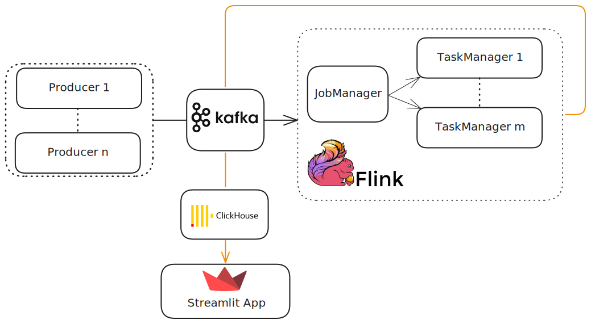

# Data Streaming Pipeline



**Интерфейсы**

- Flink Web Dashboard: `localhost:8081`

- Fares by region *(heatmap тарифов по регионам)*: `localhost:8501`

<details>
  <summary><b>NOTE</b></summary>
На схеме каждый прямоугольник &mdash; <em>контейнер</em>. 

Т.к. $n$ = `TOPICS_NUM`, $m$ = `FLINK_SCALE` $\implies$ В зависимости от конфига ВСЕГО:
$5 + n + m$.
</details>

## Получить данные

Сгенерируйте данные при помощи [Симуляции работы сервиса
такси](https://gitlab.com/event-processing-msu/taxi-simulator/) *(можно с
дефолтным 'config')*

После поместите данные симуляции в `input-data` в корне `flink-playground`

```bash
mkdir -p input-data
mv *.json /exact-path/flink-playground/input-data/
```

## Infra Setup and Start

### Конфигурация

В файле `.env` можно менять:

* `TOPICS_DATA` = $T_{1}:D_{1},T_{2}:D_{2}, \dots, T_{N}:D_{N}$, где $D_{i}$ &mdash; имя
  файла из `input-data`, $T_{i}$ &mdash; имя для соотв. топика.
  * `TOPICS_NUM` &mdash; количество пар в `TOPICS_DATA`

* `TSink` &mdash; топик для стриминга данных после обработки Flink-ом

* `FLINK_SCALE` &mdash; количество нод в кластере Flink *(кол-во TaskManager-ов)* 

* `PRODUCER` &mdash; скрипт "проигрывателя"

### Запуск

Автоматически создается `TOPICS_NUM` топиков в кластере Kafka и столько же
контейнеров `producer`, и начинается "стриминг" данных в соответствующие
топики. 

```
docker-compose up -d
```

либо чуть дольше с build:

```
docker-compose build && docker-compose up -d
```

### Остановка

```
docker-compose down -v
```

### Kafka Simple functionality test

```
docker exec -it kafka kafka-console-consumer.sh --bootstrap-server kafka:9092 --topic TOPIC_NAME --max-messages 10
```

## Запустить джобу

***! Джоба `flink/jobs/job.sql` работает с дефолтным `.env` !***

```
docker exec -it flink-jobmanager /opt/flink/bin/sql-client.sh -f /jobs/job.sql
```

Карта делится на 16 квадратов. Джоба раз в минуту обновляет тариф для каждой
зоны, на основе данных из `ride_req` и `telem`.
